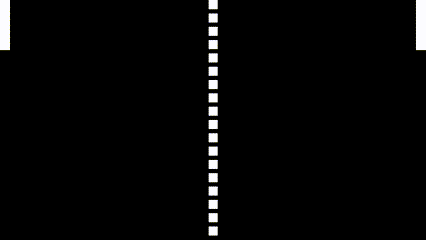

# Ping pong

<h5>
    Данный проект сделан на языке прораммировния python, с
    использованием библиотеки pygame
</h5>

 
<h3>Упарвление:</h3>

<ul>
<li> клавиши W и S отвечают за управление игроком слева</li>
<li> стелки вниз и верх отвечают за управление игроком справа</li>
<li> нажатие клавиши Enter мяч возвращяется обратно, если было выигранно очко</li>
<li> нажатие клавиши Esc выключает игру</li>
</ul>

